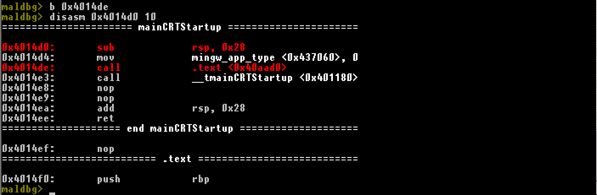
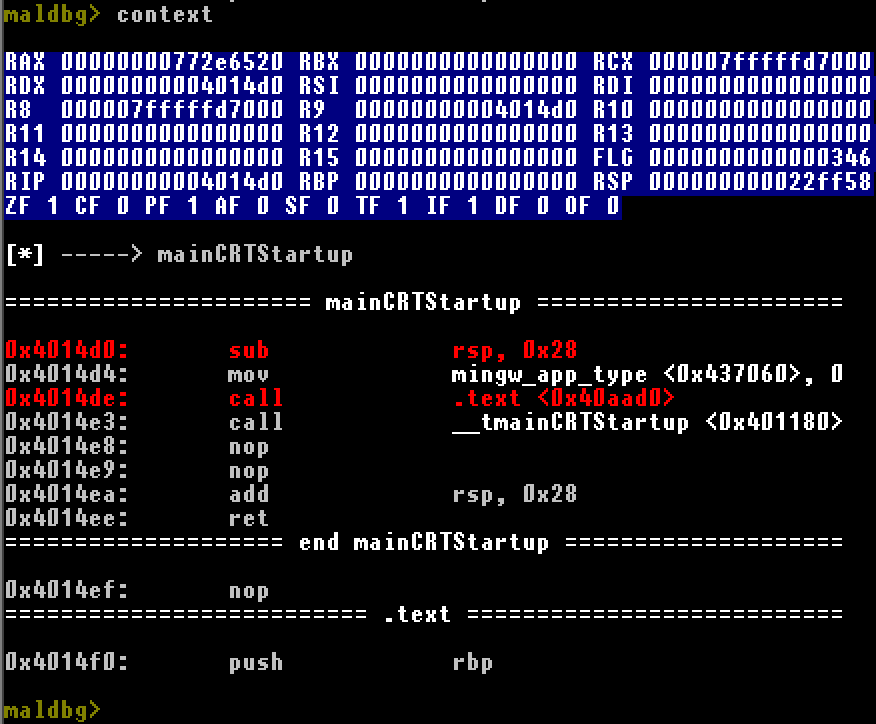
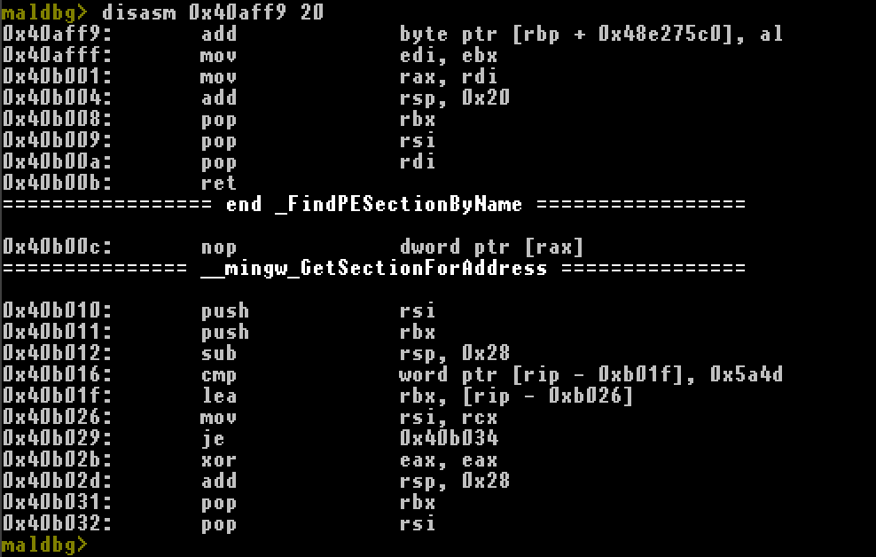
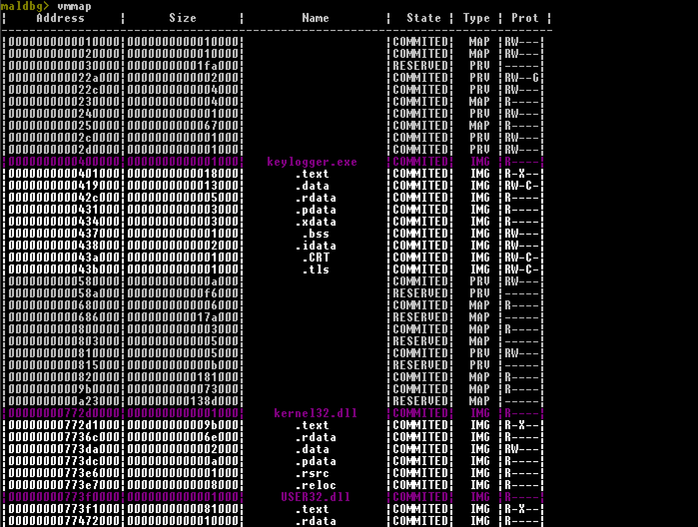
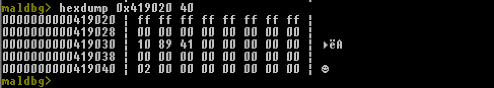
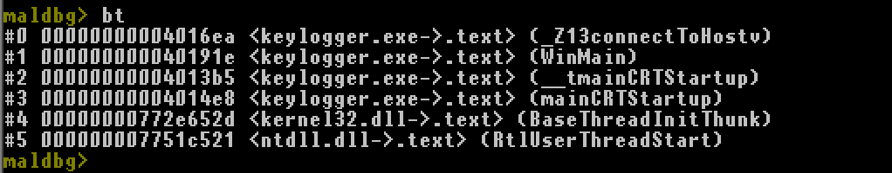
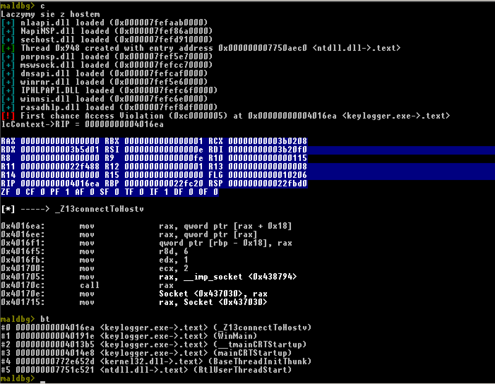

# MalDbg

Writing debugger for Windows (x86-64).
Debugger uses 
- Capstone framework to disassembly code.
- DbgHelp to get symbols for windows API (.pdb symbols not supported yet)

Tested on Windows 7 (6.1.7601 SP1) with GCC 7.3.0 and CMake 3.14.7 for MinGW produced binaries.

Debugger can contain bugs because it's just side project to learn new things and that's the reason it was built.

## How to compile
You'll need CMake and MinGW (tested) or MSVC (should work)

Compile on Windows with MinGW compiler

```
git clone --recurse-submodules https://github.com/domin568/MalDbg
mkdir build
cd build
cmake -G "MinGW Makefiles" ..
mingw32-make
```

## Usage

```
maldbg <exe>
```

## Commands

```
help
```

Show help information.

```
b, bp, br, breakpoint <hexadecimal address>
```

Breakpoint at specified hexadecimal address. 0x is optional. 

 

```
context
```

Shows current state of execution (registers, disassembly, function name if symbol available).

 

```
disasm, disassembly <hexadecimal address> <instruction count>
```

 

Disassemblies specified number of instructions at specified address.

```
c, continue
```

Continue process.

```
e, exit
```

Exit from debugger. CTRL-C not yet interrupts debugged execution, just exiting.

```
si, step in, s i
```
Step one instruction into.

```
ni, next instruction, n i
```

Step one instruction further in current frame

```
bl, show breakpoints, breakpoint list, b l, b list, breakpoint l
```

 

Show active breakpoints, their type and hit count.

```
bd, b delete, breakpoint delete <index/address>
```

Delete breakpoint by index (providing decimal number) or by address (providing hexadecimal address).

``` 
vmmap, memory mappings, map
```

 

Show map of whole virtual memory for this process including modules and their sections names.

```
hexdump, h, hex <address> <size>
```

Print 8 byte width hexdump with ASCII at specified address of given size. 
 

```
sr, set register <register> <hex value>
```

Sets register (rax, rcx, rflags...) with desired value.

```
write memory, wm <hex address> <size decimal> <hex value>
```

Write integer value at specified address up to 8 bytes.

```
backtrace, bt
```

Show current call stack of current thread.

 

## Features (for now)

1. Provide information about debugger events and exceptions raised. 
3. Prepared program structure for automating commands (like gdb script) soon.
4. Ability to disassembly instructions at specified address.
5. Shows context of actual thread after each interrupt of execution.
6. Ability to manually set breakpoints (one hit also).
7. Automatic breakpoint at entrypoint of loaded PE file.
8. Colored output for cmd.exe.
9. Next instruction and step in commands.
10. Show actual breakpoints with their hit count.
11. Delete breakpoints by index or by address.
12. Map of virtual memory for current process.
13. vmmap shows also names of modules and their sections.
14. Setting registers with desired values.
15. Printiing hexdump of memory.
16. Writing integer values to memory (up to 8 bytes)
17. Call stack with additional information.
18. COFF symbols produced by MinGW parsing, showing them in disassembly and backtracing.

## Visual presentation 

 

## TODO 
- callstack. &#x2611;
- vmmap with names (need to parse PE files). &#x2611;
- parse IAT to get function names if symbols not available
- parse .pdb
- test with MSVC compiled binaries