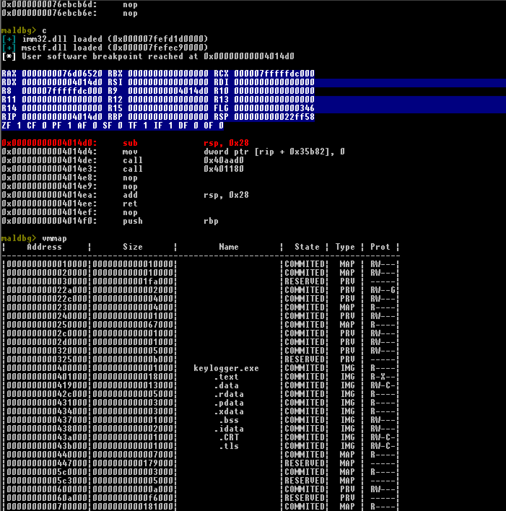

# MalDbg

Writing debugger 4fun for Windows (x86-64). Debugger uses capstone framework to disassembly code.
Tested on Windows 7 (6.1.7601 SP1) with GCC 7.3.0 and CMake 3.14.7.

## How to compile
You'll need CMake and MinGW (tested) or MSVC (should work)

Compile on Windows with MinGW compiler

```
git clone --recurse-submodules https://github.com/domin568/MalDbg
mkdir build
cd build
cmake -G "MinGW Makefiles" ..
mingw32-make
```
This will produce bin/ folder containing MalDbg.exe and shared library libcapstone.dll.
## Usage

```
maldbg <exe>
```

## Commands

```
r, run 
```

Run debugged process (or restart while running).

```
b, bp, br, breakpoint <hexadecimal address>
```

Breakpoint at specified hexadecimal address. 0x is optional. 

```
context
```

Shows current state of execution (registers + disassembly for now).

```
disasm, disassembly <hexadecimal address> <instruction count>
```

Disassemblies specified number of instructions at specified address.

```
c, continue
```

Continue process.

```
e, exit
```

Exit from debugger. CTRL-C not yet interrupts debugged execution, just exiting.

```
si, step in, s i
```
Step one instruction into.

```
ni, next instruction, n i
```

Step one instruction further in current frame

```
bl, show breakpoints, breakpoint list, b l, b list, breakpoint l
```

Show active breakpoints, their type and hit count.

```
bd, b delete, breakpoint delete <index/address>
```

Delete breakpoint by index (providing decimal number) or by address (providing hexadecimal address).

``` 
vmmap, memory mappings, map
```

Show map of whole virtual memory for this process.

```
hexdump, h, hex <address> <size>
```

Print 8 byte width hexdump with ASCII at specified address of given size. 

## Features (for now)

1. Provide information about debugger events sent and exceptions raised. 
2. Interactive mode.
3. Prepared program structure for automating commands (like gdb script).
4. Ability to disassembly instructions at specified address.
5. Shows context of actual thread after each interrupt of execution.
4. Ability to manually set breakpoints (one hit also).
5. Automatic breakpoint at entrypoint.
6. Colored output for cmd.exe.
7. Next instruction and step in commands.
8. Show actual breakpoints with their hit count.
9. Delete breakpoints by index or by address.
10. Showing map of virtual memory for current process.

## Visual presentation 

 